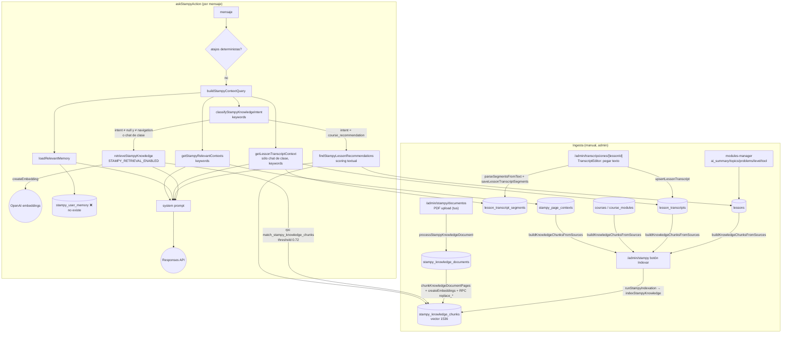

# Stampy — auditoría del sistema de conocimiento y retrieval (2026-10-06)

Relevamiento read-only. Fuente de verdad: código y migrations del repo + sondas de sólo lectura contra Supabase remoto. No se modificó código, prompts, modelos ni datos.

Leyenda: ✅ funcionando · ⚠️ parcial/infrautilizado · ❌ roto/no implementado · ❓ no verificable desde el repo.

## 0. Qué se pudo verificar en la DB remota

Con las keys de `.env.local` (sin iniciar sesión de usuario):

| Sonda | Resultado | Conclusión |
|---|---|---|
| `service_role` SELECT sobre `lessons`, `courses`, `course_modules`, `lesson_transcripts`, `lesson_transcript_segments`, `stampy_knowledge_chunks`, `stampy_page_contexts`, `stampy_messages`, `user_access_grants` | `42501 permission denied` | `service_role` no tiene SELECT aunque las migrations hacen `grant all ... to service_role`. Mismo patrón que el diagnóstico Beta. Stampy no usa service role (usa la sesión del usuario), así que no lo rompe; sí impide auditar con esa key. |
| `stampy_knowledge_documents` (service_role) | 1 documento `ready`, activo, 30 chunks, procesado 2026-08-29 | Migration `20260828103109` aplicada. |
| `stampy_user_memory` (service_role y anon) | `PGRST205 table not found in schema cache` | **La tabla de memoria no existe en remoto**: migration `20260826182313` no aplicada. |
| RPC `match_stampy_knowledge_chunks` con service_role, threshold 0 | 0 filas, sin error | Está aplicada la **versión v2** (security definer + `auth.uid() is not null`): sin sesión no devuelve nada. |
| Conteos de lessons/transcripts/chunks/embeddings | ❓ | No hay forma segura de leerlos sin sesión de usuario. Preparado: `supabase/diagnostics/20261006_stampy_knowledge_state.sql`. |
| Calidad de retrieval sobre datos reales | ❓ | Preparado: `supabase/diagnostics/20261006_stampy_retrieval_probe.sql` (embeddings de las consultas de prueba incluidos; un único SELECT). |

Ambos archivos de diagnóstico se pegan completos en el SQL Editor; no modifican nada.

## 1. Diagrama del sistema actual

## 2. Tablas involucradas

| Tabla | Definida en | Rol | Estado |
|---|---|---|---|
| `lessons` (+ `ai_summary`, `ai_topics text[]`, `ai_problems text[]`, `ai_level`, `ai_related_tool`, `is_ai_recommendable`) | base no versionada + `20260826024736` (columnas IA) | metadata de clase | ✅ existe; ❓ contenido |
| `lesson_transcripts` | `20260826024736` | transcript completo, 1 por lesson (`unique(lesson_id)`), FK `on delete cascade` | ✅ existe; ❓ filas |
| `lesson_transcript_segments` | `20260826024736` | segmentos con `start_seconds`/`end_seconds`/`position`/`confidence`, FK a transcript y lesson con cascade | ✅ existe; ❓ filas |
| `stampy_knowledge_chunks` (`embedding vector(1536)`) | `20260826024736` | chunks indexados de contextos, cursos, módulos, clases, transcripts y PDFs | ✅ existe; ❓ filas |
| `stampy_knowledge_documents` | `20260828103109` | PDFs técnicos | ✅ 1 PDF ready, 30 chunks |
| `stampy_page_contexts` | `20260826024736` | contextos editables por ruta | ✅ existe; ❓ filas |
| `stampy_user_memory` | `20260826182313` | memoria de largo plazo | ❌ **no existe en remoto** |
| `stampy_conversations` / `stampy_messages` | `20260826024736` | historial de conversación | ✅ |

`lessons.is_published` y `courses.slug` **no están definidas en ninguna migration del repo** (vienen del esquema base no versionado). El código las usa; la sección A del diagnóstico confirma si existen.

## 3. Archivos y funciones

| Paso | Archivo | Función |
|---|---|---|
| Edición de transcript | `src/app/admin/transcripciones/[lessonId]/transcript-editor.tsx` | `parseSegmentsFromText` (regex `[mm:ss]`/`hh:mm:ss`, o corte por ~700 chars sin timestamps) |
| Persistencia transcript | `src/app/admin/transcripciones/actions.ts` | `upsertLessonTranscript`, `saveLessonTranscriptSegments` (delete + insert), `deleteLessonTranscript` |
| Metadata IA | `src/components/admin/modules-manager.tsx` | formulario de clase (topics/problems por coma, en minúsculas) |
| Indexación académica | `src/lib/stampy/knowledge-indexer.ts` | `buildKnowledgeChunksFromSources`, `indexStampyKnowledge` |
| Disparo indexación | `src/app/admin/stampy/actions.ts`, `indexation-panel.tsx` | `runStampyIndexation` (botón manual) |
| PDFs | `src/lib/stampy/knowledge-document-indexer.ts`, `knowledge-document-chunking.ts`, `pdf-extraction.ts`, `src/app/admin/stampy/documentos/actions.ts` | `indexStampyKnowledgeDocument`, `chunkKnowledgeDocumentPages`, `processStampyKnowledgeDocument` |
| Embeddings | `src/lib/stampy/embeddings.ts` | `createEmbedding`, `createEmbeddings` |
| Intención | `src/lib/stampy/knowledge-intent.ts` | `classifyStampyKnowledgeIntent`, `shouldRetrieveStampyKnowledge` |
| Query de contexto | `src/lib/stampy/responses.ts` | `buildStampyContextQuery` (seguimientos cortos + mensaje anterior) |
| RAG | `src/lib/stampy/retrieval.ts`, `knowledge-retrieval-policy.ts` | `retrieveStampyKnowledge`, `prioritizeStampyRetrievedChunks` |
| Búsqueda SQL | `20260828103109` (v2 vigente) | `public.match_stampy_knowledge_chunks` |
| Transcript en clase | `src/lib/stampy/lesson-transcripts.ts` | `getLessonTranscriptContext` |
| Recomendación de clases | `src/lib/stampy/lesson-recommendations.ts` | `findStampyLessonRecommendations`, `rankStampyLessonRecommendations` |
| Contextos por ruta | `src/lib/stampy/context-search.ts` | `getStampyRelevantContexts` (keywords) |
| Memoria | `src/lib/stampy/user-memory.ts` | `extractUsefulMemory`, `saveUserMemory`, `loadRelevantMemory` |
| Orquestación | `src/app/stampy/actions.ts` | `askStampyAction` |

## 4. Pipeline de transcripts

1. **Origen**: 100 % manual. El admin pega el texto en `/admin/transcripciones/[lessonId]`. `source_type` es un `<select>` informativo (`manual`/`bunny`/`openai`/`other`): **no hay integración con Bunny Stream ni Whisper**. Bunny sólo aparece como URL de iframe del video (`lessons.video_url`). `provider`, `external_id`, `source_url`, `raw_payload`, `duration_seconds`, `generated_at` existen en el esquema pero ningún código los escribe. ⚠️
2. **Estados**: `draft | processing | ready | error`. El editor sólo usa `draft` y `ready`. Sólo `ready` es visible para usuarios (RLS) y para el indexador.
3. **Full transcript**: `lesson_transcripts.transcript_text` (texto completo). ✅
4. **Segmentos con timestamps**: `lesson_transcript_segments` (`start_seconds`, `end_seconds` = inicio del siguiente, `position`). Se generan en el navegador con regex sobre el texto pegado; sin timestamps, se corta cada ~700 chars sin tiempos. `confidence` nunca se escribe. ⚠️
5. **Actualización**: guardar reemplaza el texto (update) y borra/reinserta segmentos, en dos server actions separadas, no atómicas. `segments_count` se actualiza aparte. ⚠️
6. **Lesson eliminada**: hard delete desde `modules-manager` → `on delete cascade` borra transcript, segmentos y chunks (`stampy_knowledge_chunks.lesson_id` cascade). ✅
7. **Lesson desactivada/despublicada o transcript editado/borrado**: **no se reindexa nada**. Los chunks viejos siguen `is_active = true` y recuperables hasta la próxima indexación manual. Borrar un transcript no borra sus chunks (`lesson_transcript` no tiene FK al transcript). Si el transcript se acorta, los `chunk_N` sobrantes nunca se borran (el indexador sólo hace upsert). ❌
8. **Qué clases tienen transcript**: ❓. Ver sección C del diagnóstico.

**Por qué el diagnóstico previo pudo concluir que no existían:**
- No hay generación automática: sin Bunny/Whisper, la feature parece "no implementada".
- `StampyLessonChat` declara `transcript?: string // Pendiente` y `modules-manager` tiene el comentario "Pendiente: agregar campo transcript a lessons".
- `/docs` no documentaba RAG, transcripts ni embeddings antes del sprint anterior.
- El umbral 0.72 hace que el RAG casi nunca devuelva nada (sección 8), así que desde el chat se comporta como si no existiera.
- El esquema base de `lessons` no está en el repo.

## 5. Chunks y embeddings

**Chunks académicos** (`buildKnowledgeChunksFromSources`, una fila por fuente salvo transcripts):

| `source_type` | Contenido embebido | Condición | Route / IDs |
|---|---|---|---|
| `stampy_context` | `context` | activo, ≥10 chars | `route_pattern`; sin course/lesson |
| `course` / `workshop` | título + kind + nivel + descripción | curso `published` con descripción ≥20 | `/cursos/{course.id}`; `course_id` |
| `module` | curso + módulo + descripción | módulo activo con descripción ≥15 | `module_id`, `course_id` |
| `lesson` | curso + módulo + clase + descripción + **ai_summary + ai_topics + ai_problems + ai_related_tool** | lesson activa, `is_ai_recommendable` ≠ false, con algún contenido | `lesson_id`, `module_id`, `course_id`; metadata `aiLevel`, `relatedTool` |
| `lesson_transcript` | encabezado curso/módulo/clase + trozo de `transcript_text` | transcript `ready` de lesson activa (**no** respeta `is_ai_recommendable` ni `is_published`) | `source_key = chunk_N`; metadata `{chunkIndex}` |

- **Estrategia transcript**: corte por palabras a ~1500 chars, **sin overlap**, sin respetar oraciones, **sin timestamps** (usa `transcript_text`, no los segmentos). ⚠️
- **PDFs**: párrafos por página, objetivo 4500 chars, máximo 6000, **overlap 550**, mínimo 900; quita encabezados/pies repetidos; metadata `page_start`/`page_end`/`chunk_index`; reemplazo atómico vía `replace_stampy_knowledge_document_chunks`. ✅ Es el pipeline mejor diseñado.
- **Embeddings**: `vector(1536)`, modelo `OPENAI_EMBEDDING_MODEL` (no definido en `.env.local` → `text-embedding-3-small`). Se recorta a 8000 chars y se reemplazan `\n` por espacios. Los PDFs se embeben en un request por lote; el indexador académico, **uno por chunk y secuencial** (más un SELECT y un UPDATE/INSERT por chunk) dentro de un server action, con riesgo de timeout al crecer.
- **Cuándo se generan**: sólo al apretar "Indexar" (académico) o "Procesar" (PDF). No hay triggers, cron ni reindexación automática. ⚠️
- **Errores**: si falla el embedding de un chunk se omite y se cuenta como error; sin reintento ni backoff. Los PDF pasan a `status = error` con `extraction_error` y se reprocesan a mano. No se insertan filas sin embedding (la sección D del diagnóstico lo confirma).

## 6. pgvector / búsqueda vectorial

- Extensión `vector` (`create extension if not exists vector`).
- Función vigente (v2, `20260828103109`): `match_stampy_knowledge_chunks(query_embedding vector(1536), match_threshold float8, match_count int)`, `SECURITY DEFINER`, `STABLE`.
  - `similarity = 1 - public.cosine_distance(embedding, query_embedding)`.
  - Filtros: `auth.uid() is not null`, `has_platform_access(auth.uid())`, `is_active`, `embedding is not null`, similitud ≥ threshold, PDFs sólo si el documento está `ready` y activo.
  - `ORDER BY cosine_distance(...)`, `LIMIT least(match_count, 50)`.
  - **No acepta filtros** de curso, lesson ni ruta: `retrieval.ts` le pasa `courseId`/`lessonId`/`currentPath`, pero se ignoran.
- Índice `stampy_knowledge_chunks_embedding_ivfflat_idx` (`ivfflat vector_cosine_ops, lists = 100`). **La v2 no puede usarlo**: llama a la función `cosine_distance()` en lugar del operador `<=>` y filtra por umbral en el WHERE, así que siempre hace sequential scan. Con pocos miles de chunks no importa; además, ivfflat con 100 listas sobre una tabla chica tiene mal recall si llegara a usarse. ⚠️
- Escala: lineal en cantidad de chunks, con `has_platform_access()` evaluado por fila. Aceptable hasta unos 10k chunks.

## 7. Pipeline de retrieval por mensaje y condiciones que lo activan

`askStampyAction` (`src/app/stampy/actions.ts`), una vez descartados los atajos deterministas:

1. `getRecentHistory` → `buildStampyContextQuery`: si el mensaje es un seguimiento corto, se combina con el mensaje anterior del usuario.
2. `classifyStampyKnowledgeIntent(contextQuery)`: keywords en orden fijo (navegación → recomendación de curso → contenido de curso → negocio → slicer → calibración → problema técnico → material → general).
3. **RAG** (`shouldRetrieveStampyKnowledge`): corre si `intent ≠ null` y `intent ≠ platform_navigation`, **o** siempre que se esté en un chat de clase. Además exige `STAMPY_RETRIEVAL_ENABLED === "true"`: activo en `.env.local`; ❓ en producción.
4. `retrieveStampyKnowledge`: `createEmbedding(contextQuery)` → RPC (threshold `STAMPY_RETRIEVAL_MIN_SIMILARITY` = 0.72, `match_count` = 32) → `prioritizeStampyRetrievedChunks` (clase/curso > contexto > documento, después similitud) → hasta 8 chunks y 7000 chars → bloque "CONOCIMIENTO RELEVANTE DE ACADEMIA STAMPA" en el prompt. No hay reranking semántico. Si falla, devuelve `""` en silencio (sólo log).
5. **Tarjetas de clases** (`findStampyLessonRecommendations`): **sólo** si `intent === "course_recommendation"` (frases como "recomendame un curso", "qué clase", "tenés un video"). Scoring textual sobre título/topics/problems/summary/description/chunks de transcript, umbral de score 5, máximo 2. No usa embeddings.
6. En paralelo: contextos por ruta (keywords), memoria (keywords → tabla inexistente) y transcript de la clase actual (keywords).

**Las consultas pedidas, con el clasificador actual (mensaje inicial de una conversación):**

| Consulta | Intención | RAG global | Tarjetas de clase | Nota |
|---|---|---|---|---|
| "se me levantan las esquinas" | ninguna | **no** | no | "se me levantan" no contiene "se levanta"; "esquinas" no es keyword |
| "tengo hilos entre las piezas" | technical_troubleshooting | sí | no | |
| "la primera capa no se pega" | technical_troubleshooting | sí | no | |
| "qué relleno debería usar" | ninguna | **no** | no | "relleno" e "infill" no son keywords |
| "los soportes quedan demasiado pegados" | slicer_help | sí | no | |
| "tengo stringing con PETG" | technical_troubleshooting | sí | no | |
| "qué es el infill" | ninguna | **no** | no | |
| "¿tenemos una clase de warping?" | course_content_question | sí | **no** | pide una clase pero no coincide con las frases de `course_recommendation` |

En un chat de clase, las 8 disparan RAG. Aclaración sobre el sprint anterior: "las clases sólo se buscan cuando se pide explícitamente una clase" se refería a las **tarjetas** (ranking textual). El RAG con embeddings es otra condición, más amplia, pero depende igual de keywords: cualquier consulta sin keyword conocida queda sin RAG.

## 8. Calidad del retrieval: resultados

**No se pudieron leer los chunks reales** (sección 0). Para estimar el comportamiento del umbral se compararon las consultas de prueba contra pasajes **sintéticos** con el formato exacto del indexador, escritos para ser claramente relevantes (`text-embedding-3-small`):

| Consulta | Pasaje sintético | Similitud |
|---|---|---|
| se me levantan las esquinas | clase "Warping y adherencia" (con "se levantan las esquinas" en problemas) | 0.324 |
| se me levantan las esquinas | trozo de transcripción hablada sobre warping | 0.308 |
| tengo hilos entre las piezas | clase "Retracción y stringing" | 0.507 |
| la primera capa no se pega | clase "Primera capa perfecta" | 0.566 |
| qué relleno debería usar | clase "Relleno e infill" | 0.544 |
| los soportes quedan demasiado pegados | clase "Soportes fáciles de retirar" | 0.529 |
| se me levantan las esquinas | clase "Cómo cobrar una impresión" (no relacionada) | 0.165 |

Con `text-embedding-3-small`, consulta corta contra pasaje largo, los pares **muy relevantes quedan entre 0.31 y 0.57** y los no relacionados alrededor de 0.16. **El umbral 0.72 descarta prácticamente todo**: lo más probable es que el RAG devuelva vacío en casi todas las consultas reales. Los transcripts hablados (0.31) son los peor parados. Confirmar con `supabase/diagnostics/20261006_stampy_retrieval_probe.sql`, que muestra top 10, similitud, si pasa 0.72 y el `app_rank` que usaría `retrieval.ts`. También se puede contar `chunksFound: 0` en los logs `[Stampy] retrieval` del servidor.

## 9. Retrieval dentro de una clase (`StampyLessonChat`)

- Envía `lessonId`, `courseId`, título, resumen, topics, problems y nivel. Desde el sprint anterior el servidor los usa como bloque "CLASE QUE LA PERSONA ESTÁ VIENDO", primero en el contexto. ✅
- **Transcript contextual** (`getLessonTranscriptContext`): si hay transcript `ready`, toma **sólo los primeros 80 segmentos** por posición, los puntúa por coincidencia de palabras (tokens de más de 2 letras sin stopwords) y manda los 12 mejores con `[mm:ss]`. Sin coincidencias, manda los primeros segmentos hasta 7500 chars. Sin segmentos, los primeros 8000 chars del texto. Tope 8000. ⚠️ El contenido después del segmento 80 nunca es alcanzable, y "¿por qué?" o "explicame mejor" no coinciden con nada (desde el sprint anterior se usa `contextQuery`, que ayuda en seguimientos).
- **RAG en clase**: siempre activo, pero **global**: la RPC ignora `lessonId`/`courseId`, así que puede traer chunks de otras clases o del PDF antes que los de la clase actual. Con 0.72 lo normal es que no traiga nada. ⚠️
- **Timestamp del video**: no existe. Ni el player ni el payload informan la posición actual. ❌
- **¿Puede responder con contenido real de la clase?** Sí, cuando hay transcript `ready` y la pregunta comparte palabras con sus primeros 80 segmentos. Si no, sólo tiene la metadata IA de la clase. `lesson.transcript` del cliente siempre es `undefined` (la columna no existe).

## 10. Metadata IA

| Campo | Lo usa | Cómo |
|---|---|---|
| `ai_summary` | indexador (chunk `lesson`), ranking textual (+3 por término), prompt de clase | embebido sólo dentro del chunk `lesson`; el ranking es textual |
| `ai_topics` | indexador (contenido y tags), ranking (+5), tags de chunks de transcript, prompt de clase | idem |
| `ai_problems` | indexador, ranking (+5), prompt de clase | es el mejor puente con el lenguaje del alumno ("se levantan las esquinas"), pero sólo pesa en el ranking textual, y el ranking sólo corre con `course_recommendation` |
| `ai_level` | metadata del chunk, tarjetas, prompt de clase | no filtra ni ordena |
| `ai_related_tool` | contenido y metadata del chunk `lesson` | no se usa en runtime fuera del chunk |
| `is_ai_recommendable` | indexador (excluye el chunk `lesson`), elegibilidad de tarjetas | **no** excluye los chunks de transcript de esa clase |

Dependen de matching textual: intención, activación del RAG, tarjetas de clase, contextos por ruta, segmentos de transcript en clase, relevancia de memoria y herramientas de `app-knowledge`. El único componente semántico es la RPC, condicionada por keywords y por el umbral.

Las tarjetas además filtran `lessons.is_published = true`. Esa columna no está versionada y `modules-manager` no la escribe. Si no existe, la query falla y **las tarjetas devuelven siempre `[]`** (sólo queda un log). Si existe con default `false`, el efecto es el mismo. ❓ Lo confirma la sección A/B del diagnóstico.

## 11. Memoria

- Tabla `stampy_user_memory` (`category ∈ software|hardware|printing|business|workflow`, `memory_key`, `memory_value` ≤250, `confidence`, `source_message_id`; unique por hecho). Función `save_stampy_user_memory` (security invoker, deduplicación atómica). RLS: el usuario sólo lee y escribe lo suyo y con acceso pago; los admins ven todo; **no hay policy de DELETE para el usuario ni UI para ver o borrar memorias**; sin expiración.
- Se guarda **por reglas** (`extractUsefulMemory`, regex: "siempre uso Orca", "tengo nozzle 0,6", "vendo mates", etc.), después de persistir la respuesta. Se recupera por categorías inferidas con keywords; hasta 50 filas, rankeadas, top 10, prompt de 1200 chars como "MEMORIAS ÚTILES DEL USUARIO".
- Historial ≠ memoria: el historial son los últimos 12 mensajes de **la conversación activa**; la memoria son hechos cruzados entre conversaciones.
- **Estado real: ❌ la tabla no existe en remoto.** Cada carga devuelve error (log `[Stampy] memory load failed`) y cada guardado falla; no se ve en la UI porque los errores se tragan. En la práctica Stampy no tiene memoria de largo plazo.

## 12. Clasificación

| Pieza | Estado |
|---|---|
| Esquema de transcripts y segmentos | ✅ |
| Carga de transcripts | ⚠️ manual; sin Bunny/Whisper; metadata de origen sin usar |
| Pipeline de PDFs (chunking con overlap, reemplazo atómico) | ✅ |
| Indexación académica | ⚠️ manual, secuencial, sin reintentos, sin limpiar chunks viejos |
| Sincronización de chunks con cambios de clase/transcript | ❌ |
| Chunking de transcripts | ⚠️ sin overlap, sin timestamps, corta oraciones |
| Embeddings / pgvector | ✅ almacenados; ⚠️ índice inutilizado |
| RPC de búsqueda | ⚠️ funciona; sin filtros por clase o curso |
| Umbral 0.72 | ❌ muy probablemente descarta todo (evidencia sintética) |
| Activación del RAG | ⚠️ depende de keywords; consultas comunes sin keyword no lo disparan |
| Tarjetas de clase | ⚠️ sólo con frases de pedido explícito; ❓ posiblemente siempre vacías por `is_published` |
| Transcript en chat de clase | ⚠️ sólo los primeros 80 segmentos; matching por palabras |
| Timestamp de video | ❌ |
| Metadata IA | ⚠️ cargable; sólo semántica dentro del chunk `lesson` |
| Memoria | ❌ tabla inexistente en remoto |
| Privilegios de `service_role` | ⚠️ sin SELECT en tablas que las migrations le otorgan (transversal, no sólo Stampy) |

## Qué funciona bien

- El modelo de datos (transcript completo + segmentos con tiempos + chunks con IDs de curso, módulo y clase) es correcto y suficiente para un RAG por clase.
- El pipeline de PDFs es robusto: limpieza, overlap, metadata de páginas, reemplazo atómico, visibilidad controlada por RPC.
- Seguridad: lectura de chunks y transcripts restringida a usuarios con acceso; los PDFs sólo salen por la RPC; Stampy no usa service role.
- Las tarjetas de clase nunca inventan: sólo clases elegibles y con score.

## Qué está infrautilizado

- Embeddings ya calculados que casi nunca se recuperan, por el umbral y la activación por keywords.
- `ai_problems` y `ai_topics`, el mejor vínculo con el lenguaje del alumno, pesan sólo en el ranking textual que casi nunca corre.
- Segmentos con timestamps: no se usan para chunking ni para citar el minuto de la clase.
- `lessonId`/`courseId` llegan a `retrieveStampyKnowledge` pero la búsqueda es global.

## Qué está roto o mal diseñado

1. Umbral 0.72 incompatible con `text-embedding-3-small` en este tipo de consultas.
2. `stampy_user_memory` inexistente en remoto, con código que la usa en cada mensaje.
3. Chunks obsoletos: nada desactiva ni borra chunks de clases despublicadas, transcripts borrados o acortados.
4. La RPC v2 no puede usar el índice vectorial.
5. Filtro de tarjetas por `lessons.is_published`, columna no versionada y que el admin no gestiona.
6. Activación del RAG y de las tarjetas por keywords: falla con formulaciones naturales ("se me levantan las esquinas", "qué relleno uso", "¿tenemos una clase de warping?").
7. Transcript en clase limitado a los primeros 80 segmentos.

## Qué convendría mejorar primero (sin implementar)

1. **Verificar el estado real**: correr los dos SQL de diagnóstico. Es barato y decide el resto: si `is_published` existe, cuántos transcripts y chunks hay, y qué similitudes reales salen.
2. **Calibrar el umbral con datos reales** (la sonda de retrieval da la distribución). Es un cambio de configuración (`STAMPY_RETRIEVAL_MIN_SIMILARITY`) y probablemente el de mayor impacto inmediato.
3. **Desacoplar la activación del RAG de las keywords**: buscar siempre en consultas de conocimiento y dejar que la similitud decida, en lugar de que el clasificador decida si se busca.
4. **Resolver la memoria**: aplicar la migration pendiente o desactivar el código que la usa. Hoy genera errores silenciosos en cada mensaje.
5. Después: filtro por clase en la RPC para el chat de clase, limpieza de chunks obsoletos al reindexar, chunking de transcripts por segmentos con overlap y timestamps.
